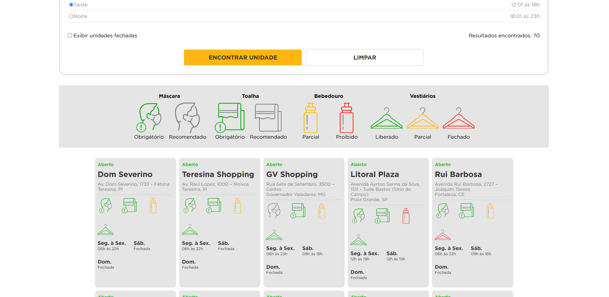

<h1 align="center" style="font-weight: bold;">Desafio Smart Fit</h1>

<p align="center">
 <a href="#tech">Technologies</a> • 
 <a href="#started">Getting Started</a> • 
</p>

<p align="center">
    <b>Solução para o desafio da Smart Fit</b>
</p>

<h2 id="layout">🎨 Layout</h2>

<p align="center">
    
    
</p>

<h2 id="technologies">💻 Technologies</h2>

- Angular

<h2 id="started">🚀 Getting started</h2>

```sh
npm install
```

```sh
npm run start
```

## Author

**João Marcos**

- Github: [@joaoMarcos777](https://github.com/joaoMarcos777)
- LinkedIn: [@joaomarcos777](https://linkedin.com/in/joaomarcos777)
